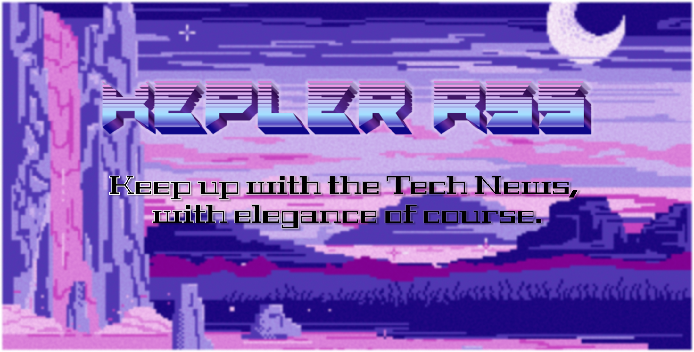

## Kepler RSS : An RSS Feed Parser

- Access to your feeds both from the web interface and from the command-line.



### How it's made (website):
- Python Flask api and feedparser
- gunicorn as the WSGI server
- Jinja2 Templating engine and HTMX

For now:

```bash
uv run python src/app.py

```
Start the app in a dev environment:
```bash
uv run python src/app.py

```

Start the app in a prod environment:
```sh
poetry run python gunicorn -w 4 app:app
```

### Features (website):

- A retro-futuristic UI
- Paste an RSS link in the input form, click Fetch Feed and you will retrieve articles.
- A Download Button will appear, allowing you to download the desired feed as a .txt file.

### How it's made (cli):
- Python argparse and feedparser

Run in the command line:
```sh
poetry run python rss-cli.py <your-rss-link>
```

Add a `--save` flag to download the output into a .txt file.
